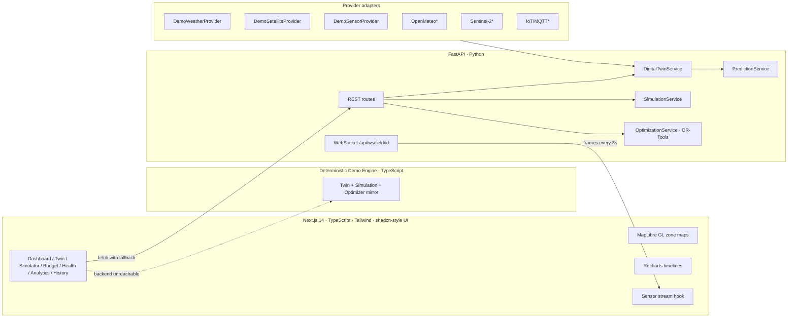

# AquaTwin — AI Irrigation Optimizer

**Team Absolute Cinema · SRKR Engineering College · Vishnu College Hackathon**

> **Simulate the future of your field before using a single drop.**

AquaTwin is a software-first **field digital twin** for irrigation decisions. Instead of another "smart irrigation dashboard," it builds a virtual copy of the field — root-zone moisture, evapotranspiration, effective rainfall, soil water balance — and tests every irrigation decision against it *before* water is released.

The prototype runs **100% offline with deterministic, seeded demo data**. No API keys, no hardware, no external services required.

---

## Problem

Farmers irrigate on fixed schedules, habit, or guesswork — without simultaneously weighing soil moisture, crop growth stage, weather forecasts, satellite-derived signals, irrigation history, and limited water availability. The result: over-irrigation, water waste, crop stress, and unnecessary cost.

## Innovation

| Capability | What it does |
|---|---|
| **Field Digital Twin** | FAO-56-inspired water balance: ETc from solar radiation, effective rainfall, percolation, depletion-driven stress model |
| **What-If Simulation** | Projects 48h soil-moisture trajectories for irrigate-now / wait 3/6/12/24h / partial deficit strategies |
| **Water Budget Optimizer** | OR-Tools CP-SAT allocates limited water to maximize priority-weighted stress reduction under the total-water constraint |
| **Weather Uncertainty** | Re-runs the recommended plan under rain-occurs / rain-partial / rain-fails outcomes with explicit verdicts |
| **Field Water Fingerprint** | Learned field characteristics: retention, drying rate, irrigation/rain response, recovery time |
| **Explainable AI** | Deterministic explanation layer over structured twin/simulation/optimizer output (optional Gemini adapter) |

## Architecture



\* production adapters implement the same interface and plug in without route/service changes.

## Technology Stack

- **Frontend**: Next.js 14, TypeScript, Tailwind CSS, Radix primitives, MapLibre GL, Recharts, Framer Motion, lucide-react
- **Backend**: FastAPI, Pydantic, NumPy, SciPy, scikit-learn-ready model wrappers, OR-Tools (CP-SAT)
- **Digital twin math**: FAO-56-style water balance — field capacity/wilting point, TAW, depletion, ET0 from solar radiation, crop coefficient, paddy percolation
- **Demo data**: seeded (NumPy `default_rng(42)` / mulberry32) — every value reproducible

## Core Features (pages)

| Route | Purpose |
|---|---|
| `/` | Landing: problem, how it works, feature sections |
| `/dashboard` | Farm Intelligence: KPIs, zone map, AI recommendation, sensor trend, upcoming events |
| `/twin` | Field Digital Twin: 4-zone map with layer switching (moisture/stress/NDVI-style/priority), zone panel, water-balance state cards |
| `/simulator` | What-If Simulator: 6 strategies, 48h projection chart, scenario cards, "why this scenario", rain-failure mode |
| `/water-budget` | Water Budget Optimizer: 500–3000 L slider, animated allocation bars, before/after stress, constraint status |
| `/field-health` | Geospatial analytics + health index + honest "demo layer" labeling |
| `/analytics` | 7-day charts, prediction vs actual, Field Water Fingerprint |
| `/history` | Filterable decision log with reasons + prediction-vs-actual |
| `/settings` | Demo mode, provider adapters, backend connection, Reset Demo |

## Digital Twin Model

- Soil: FC 34%, WP 14%, 300 mm root zone → TAW 60 mm
- Daily `ET0` from forecast solar radiation; `ETc = ET0 × Kc(1.12)` (reproductive rice)
- Effective rainfall at 80% infiltration efficiency; paddy seepage/percolation 0.35 mm/h
- Depletion `Dr` drives a logistic crop-stress proxy (calibrated: 8% at current 24.6% moisture, 46% near wilting)
- Irrigation converts litres → moisture points with a demo-calibrated factor (720 L ≈ +14 points)

Recommendation policy: lowest water use among scenarios with stress ≤ 15% **and** ≥ 23.5% carryover moisture at horizon end.

## Demo Mode

- Global **DEMO MODE** badge and per-panel source labels ("Demo Data", "Simulated Sensor Stream", "Satellite-derived demo layer")
- The frontend ships an **identical deterministic engine** — if the FastAPI backend is unreachable, every page still works with the same numbers (header shows "Engine: Demo Engine" vs "FastAPI")
- The sensor stream tries the backend WebSocket first, then falls back to an in-process simulated stream
- **Reset Demo** in Settings

## Local Development

```bash
# Frontend
npm install
npm run dev          # http://localhost:3000

# Backend (optional — frontend falls back to its built-in engine)
cd backend
pip install -r requirements.txt
python -m uvicorn app.main:app --port 8000
# Interactive docs: http://localhost:8000/docs
```

Production build: `npm run build && npm start`

## Environment Variables

See `.env.example` (frontend) and `backend/.env.example`. **All values optional:**

| Variable | Purpose |
|---|---|
| `NEXT_PUBLIC_API_BASE` | Backend URL; empty → in-browser demo engine |
| `GEMINI_API_KEY` | Optional explanation-layer LLM (never numeric decisions) |
| `DATABASE_URL` | Optional persistence (PostgreSQL/TimescaleDB) |
| `REDIS_URL` | Optional cache |

## API Documentation

| Method | Route | Description |
|---|---|---|
| GET | `/api/farms` | Farms with fields |
| GET | `/api/fields/{id}` | Field + crop |
| GET | `/api/fields/{id}/state` | Twin water-balance state |
| GET | `/api/fields/{id}/zones` | Zones + zone states |
| GET | `/api/fields/{id}/weather` | 48h forecast + 7d observations |
| GET | `/api/fields/{id}/satellite` | NDVI/NDWI-style series |
| GET | `/api/fields/{id}/sensors` | Sensor snapshot |
| GET | `/api/fields/{id}/history` | Irrigation events |
| POST | `/api/simulation/run` | Full what-if scenario set |
| POST | `/api/simulation/rain-uncertainty` | Rain outcome stress analysis |
| POST | `/api/water-budget/optimize` | OR-Tools allocation |
| GET | `/api/recommendation` | Explainable recommendation |
| GET | `/api/analytics/water-fingerprint` | Learned field characteristics |
| GET | `/api/system/status` | System status indicator |
| WS | `/api/ws/field/{id}` | Sensor frames every 3s |

## Future Hardware Integration

All data flows through three adapter interfaces (`WeatherProvider`, `SatelliteProvider`, `SensorProvider` — `backend/app/services/adapters.py`, mirrored on the frontend). To connect real infrastructure:

1. **Sensors**: implement `IoTSensorProvider` (MQTT/LoRaWAN bridge) returning the same `Sensor` shape
2. **Weather**: implement `OpenMeteoWeatherProvider` (keyless) or a commercial API
3. **Satellite**: implement `SentinelSatelliteProvider` (Copernicus Data Space) — the UI already labels layers as satellite-derived
4. **Persistence**: set `DATABASE_URL`; the schema (Farms, Fields, Zones, Sensors, WeatherObservations, IrrigationEvents, Simulations, Predictions, Optimizations) maps 1:1 to the Pydantic models

## Honesty Guarantees

- No fake accuracy metrics — confidence values are labeled model confidence
- No real-time or real-measurement claims — every demo surface is labeled
- The assistant explains decisions; it never generates them
